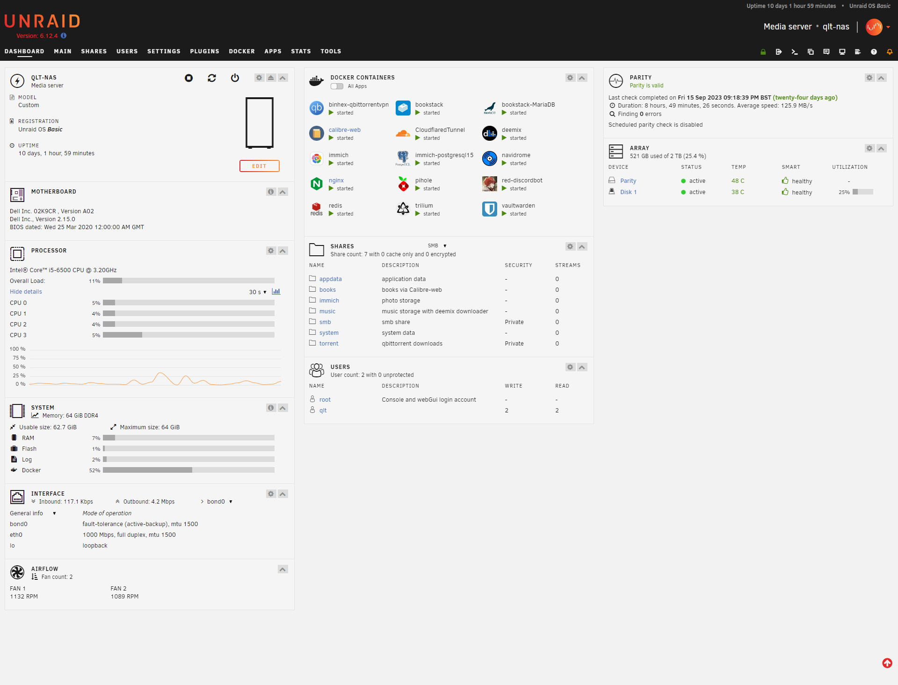

# Homelab

 

## Homepage

## Description

I purchased an old office PC to use as a Homelab setup with the main purpose of reducing costs associated with common digital services like Google Photos, iCloud, or Spotify. Along the way, it has also helped me solidify my knowledge in DevOps, network administration, and IT deployment.

I would say this project will never be truly complete, as there is always something I want to change, whether it's the storage size or the implementation of more Docker services.

One of my plans is to implement a larger storage size, hopefully enabling me to store Blu-Ray-sized movies and stream them over the internet. I also hope to host a Minecraft server for friends to play on.

UNRAID is not a safe operating system in terms of an enterprise environment, primarily because everything you run operates mostly as root. It's great for home use as it gets things running quickly. However, if I had to run virtualization in an enterprise setting, I would use Proxmox or ESXi as they are much more secure and reliable.

## Hosted services

+ [Trillium](https://github.com/zadam/trilium) - A knowledge database, offering a good alternative to common services such as Notion, Evernote, etc.
+ [Calibre Web](https://github.com/janeczku/calibre-web) - A book media server where I keep all my ebooks accessible from anywhere. I use it to send ebooks to my Kindle.
+ ~[Immich](https://github.com/immich-app/immich) - A Google Photos alternative that features things such as facial recognition, which uses machine learning for facial recognition.~
+ [NextCloud](https://github.com/nextcloud) - I now run Nextcloud as an alternative to Immich. Nextcloud, at its core, is a cloud storage platform. However, in order to become as feature-rich as Google Photos, it relies on plugins like Memories, Recognition, and Facial Recognition. These plugins enable it to operate in a manner similar to Google Photos.
+ [Navidrome](https://github.com/navidrome/navidrome) - A music media server where I keep all my ripped music. It is accessible from anywhere, and I can also allow my music to cache on my phone so I can access it when I am not connected.
+ [Vaultwarden](https://github.com/dani-garcia/vaultwarden) - A password manager, which is a fork of Bitwarden. It's great as a privacy alternative, allowing me to keep sensitive information offsite.
+ ~[Bookstack](https://github.com/BookStackApp/BookStack) - This is where I keep sensitive information about the server. I do not expose this service, and it can only be accessed from the LAN.~
+ [Pi Hole](https://github.com/pi-hole/pi-hole) - A DNS server that also serves as an ad blocker for my home network.
+ ~[Red-Discordbot](https://github.com/Cog-Creators/Red-DiscordBot) - I use this to play music on my Discord servers. Previously, there were public music bots like Groovy or Hydra that allowed you to play music on Discord servers. However, due to copyright reasons, they had to be taken down. I now choose to run a private music bot, which is only available for personal use.~
+ [Nginx](https://nginx.org/) - This is a web server, i use this run my personal [website](https://qltcloud.com/).
+ [StirlingPDF](https://github.com/Frooodle/Stirling-PDF) - This is a web-based PDF tool, and personally, I have a strong aversion to how most PDF tools are currently developed and operated. I only recently stumbled upon this project, and I appreciate the fact that it serves as an excellent open-source alternative. When I examine its features, I find that I no longer need to turn to other PDF tools.

## Changelog

+ 31st October 2023 - No longer run Immich. Immich is a very promising project, and I hope it continues to develop further. However, it is still in its early stages, and there are still bugs and errors that make it challenging to use as a reliable Google Photos alternative for now. I also now run StirlingPDF, reducing my reliance on other online PDF tools or desktop tools such as Adobe Acrobat.
+ 6th November 2023 - I no longer run Red Discord Bot on my server. There is times where i choose to shut down the server. Therefore, disconnecting the bot from discord. Which prevents my friends from being able to use it. I now run Red Discord Bot on Oracle Cloud, utilising their free instances.

## Hardware

Dell Precision 3420:
- CPU: i5-6500
- RAM: ECC DDR4-2133 16 GB x 4
- Motherboard:  Intel C236 chipset
- Storage (Parity Drive): 4 TB Western Digital WD4000FYYZ
- Storage (Primary Drive): 2 TB Patriot P210

# Reference
+ [awesome-selfhosted/awesome-selfhosted](https://github.com/awesome-selfhosted/awesome-selfhosted) - A list of Free Software network services and web applications which can be hosted on your own servers.
+ [UNRAID](https://https://unraid.net/) - Operating system i use to run the services i use.
